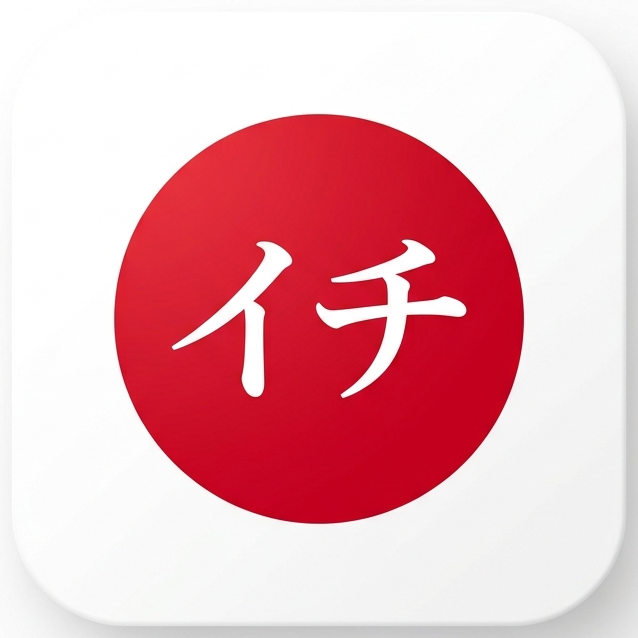

<p align="center">
  
</p>

<h1 align="center">ICHI ・ イチ <sub><sup>for macOS</sup></sub></h1>

<p align="center">
  <strong>The definitive window snapping utility — ported to macOS.</strong><br>
  <em>Built in Rust for power, precision, and performance.</em>
</p>

<p align="center">
  <a href="https://github.com/mortenlein/ichi-mac/actions/workflows/ci.yml">
    
  </a>
  <a href="https://github.com/mortenlein/ichi-mac/releases/latest">
    
  </a>
  <a href="LICENSE">
    
  </a>
</p>

---

**Ichi** (イチ, meaning **"One"** or **"#1"**) is a high-performance, minimalist
window-snapping utility. This is the macOS port of
[the Windows original](https://github.com/mortenlein/ichi) — same snap geometry,
same hotkeys, same stay-out-of-the-way philosophy, rewritten against the
Accessibility and Carbon APIs instead of Win32.

## 🚀 Key Features

- **Identical geometry**: `engine.rs` is a straight port of the Windows snap
  math, so a window lands in exactly the same place on both platforms.
- **Stealth Mode**: runs as a background agent — no Dock icon, no Cmd-Tab entry,
  no window. It never steals focus.
- **Menu bar icon**: the hinomaru sits in the menu bar with a small menu showing
  the version, whether Accessibility access has been granted, and Quit.
- **Multi-Tap Cycling**: pressing the same hotkey repeatedly cycles through
  layout ratios (1/2, 1/3, 2/3).
- **Multi-display aware**: snaps within whichever display the window mostly
  occupies, respecting the menu bar and Dock.
- **Small**: ~314 KB stripped binary, six direct dependencies.

## ⌨️ Global Hotkeys

All actions are triggered via **Ctrl + Option + Numpad** (Option is the key
labelled `alt`), matching the Windows build's Ctrl + Alt + Numpad:

| Hotkey | Action | Cycle Ratios |
| :--- | :--- | :--- |
| **Numpad 5** | Center / Maximize | 100% → 80% → 60% Center |
| **Numpad 4 / 6** | Left / Right Half | 1/2 → 1/3 → 2/3 Width |
| **Numpad 8 / 2** | Top / Bottom Half | 1/2 → 1/3 → 2/3 Height |
| **Numpad 7 / 9** | Top Left / Right | 1/2 → 1/3 → 2/3 Corner |
| **Numpad 1 / 3** | Bottom Left / Right | 1/2 → 1/3 → 2/3 Corner |

> **⚠️ A numeric keypad is required.** These bindings use the dedicated keypad
> key codes (`kVK_ANSI_Keypad1`–`9`), which a MacBook's built-in keyboard does
> not have — the number row sends different codes and will not trigger Ichi.
> Use an external full-size keyboard, or change `KEYPAD_BINDINGS` in
> `src/hotkeys.rs` to the key codes you prefer.

## 🏗️ Architecture

The port replaces every OS-facing call; the geometry engine is untouched.

| Concern | Windows | macOS (this build) |
| :--- | :--- | :--- |
| Global hotkeys | `WH_KEYBOARD_LL` hook | `RegisterEventHotKey` (Carbon) |
| Move / resize | `SetWindowPos` | Accessibility API (`AXUIElement`) |
| Work area | `GetMonitorInfoW` | `NSScreen.visibleFrame` |
| Flicker control | `WM_SETREDRAW` | not needed — Quartz composites |
| Frame correction | `DWMWA_EXTENDED_FRAME_BOUNDS` | not needed — AX frames are exact |

Two details are worth knowing:

1. **Coordinate flip.** AppKit measures from the bottom-left with Y increasing
   upward; the Accessibility API measures from the top-left with Y increasing
   downward — the same convention as Win32. `window.rs` converts `NSScreen`
   rects into AX space, which is why the shared engine needs no changes.

2. **`RegisterEventHotKey` over an event tap.** It needs no Accessibility
   permission of its own and only ever sees the nine registered combinations,
   rather than the whole keystroke stream. The system also consumes a matched
   hotkey before the focused app sees it — the same effect the Windows build
   gets by returning `LRESULT(1)` from its hook.

### Inherited rounding

On a work area with an odd height, the top and bottom halves each truncate to
the same integer and leave a one-pixel seam (e.g. 1055 ÷ 2 → 527 + 527). This
comes from the original Windows engine and is reproduced deliberately so both
builds place windows identically. See
`engine::tests::vertical_halves_respect_the_menu_bar_inset`.

## 🛠️ Building & Installation

### Prerequisites
- [Rust Toolchain](https://rustup.rs/) (Stable)
- Xcode Command Line Tools (`xcode-select --install`)
- macOS 11 or later

### Build

```bash
./bundle.sh
mv target/Ichi.app /Applications/
open /Applications/Ichi.app
```

### Grant Accessibility access

Moving another application's windows requires it. On first launch Ichi raises
the system prompt; otherwise:

**System Settings → Privacy & Security → Accessibility** → enable **Ichi**.

Then **relaunch Ichi** — macOS only applies the grant to a freshly started
process.

> `bundle.sh` ad-hoc signs the app (`codesign --sign -`). That is enough for
> the permission to stick across rebuilds on *this* machine. To share the app
> with anyone else, substitute a Developer ID and notarize it.

### Run at login

**System Settings → General → Login Items → Open at Login → +** and pick
`/Applications/Ichi.app`.

### Run from source (development)

```bash
cargo run --release
```

Note that a bare binary launched from a terminal inherits the *terminal's*
Accessibility permission, so snapping will only work if your terminal has been
granted access. The bundle is the supported path.

## 📦 Releases

Two workflows run on GitHub Actions:

| Workflow | Trigger | Does |
| :--- | :--- | :--- |
| `ci.yml` | push to `main`, PRs | `cargo fmt --check`, clippy with `-D warnings`, tests, and a bundling smoke test |
| `release.yml` | tag `v*`, or manual dispatch | builds a universal binary, packages `.dmg` + `.zip`, opens a **draft** release |

Cutting a release mirrors the Windows repo — bump `version` in `Cargo.toml`, then:

```bash
git tag v0.1.0 && git push origin v0.1.0
```

The release is left as a draft so you can review the artifacts before
publishing.

### Building release artifacts locally

```bash
./bundle.sh --universal --dmg
```

Produces `target/Ichi-<version>.dmg` and `target/Ichi-<version>-macos.zip`.
`package.sh` handles the packaging step on its own, which is what lets the
release workflow sign, notarize, and staple the app *before* it is wrapped up.

### ⚠️ Gatekeeper and code signing

By default both the local build and CI sign **ad-hoc**, which is only trusted on
the machine that produced it. A downloaded ad-hoc build is quarantined, and
macOS refuses to open it — usually claiming the app is "damaged". The escape
hatch is:

```bash
xattr -dr com.apple.quarantine /Applications/Ichi.app
```

That is fine for your own machine, but it is not something to ask other people
to do. To ship properly, add these repository secrets and the release workflow
will sign with your Developer ID and notarize with Apple automatically:

| Secret | What it is |
| :--- | :--- |
| `MACOS_CERTIFICATE` | Developer ID Application cert, exported as `.p12`, base64-encoded |
| `MACOS_CERTIFICATE_PWD` | Password used when exporting that `.p12` |
| `MACOS_SIGNING_IDENTITY` | e.g. `Developer ID Application: Your Name (TEAMID)` |
| `APPLE_ID` | Apple ID used for notarization |
| `APPLE_TEAM_ID` | Your 10-character team ID |
| `APPLE_APP_PASSWORD` | An [app-specific password](https://support.apple.com/en-us/102654), not your Apple ID password |

With `MACOS_CERTIFICATE` absent the workflow still succeeds — it warns, and adds
the quarantine instructions to the release notes. Signing locally works the same
way:

```bash
SIGN_IDENTITY="Developer ID Application: Your Name (TEAMID)" ./bundle.sh --universal
```

Note that a Developer ID requires a paid Apple Developer Program membership.

### Tests

```bash
cargo test
```

17 tests cover the snap geometry (grid positions, cycle ratios, work-area
offsets, multi-display selection), the AppKit→AX coordinate flip, the Carbon
four-character-code and key-code constants, and the embedded menu bar asset.

### Regenerating the menu bar icon

`src/menubar-icon.png` is derived from `icon.png` and embedded in the binary
via `include_bytes!`, so it works identically under `cargo run` and in the
bundle. The app icon's white rounded square would read as a bright blob in the
menu bar, so the generator finds the red circle, crops to it, and clips to an
ellipse — leaving the surround transparent and the white イチ intact.

After changing `icon.png`:

```bash
swift make_menubar_icon.swift
```

## 📄 License

MIT — see [LICENSE](LICENSE).
